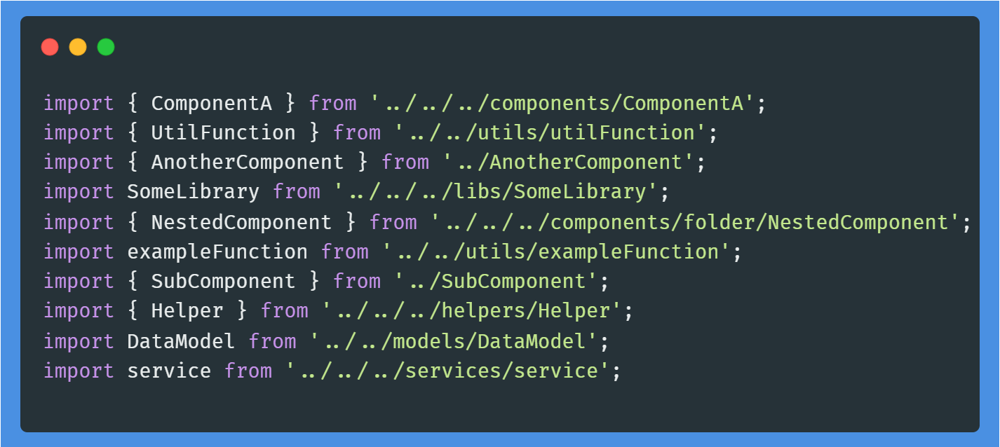
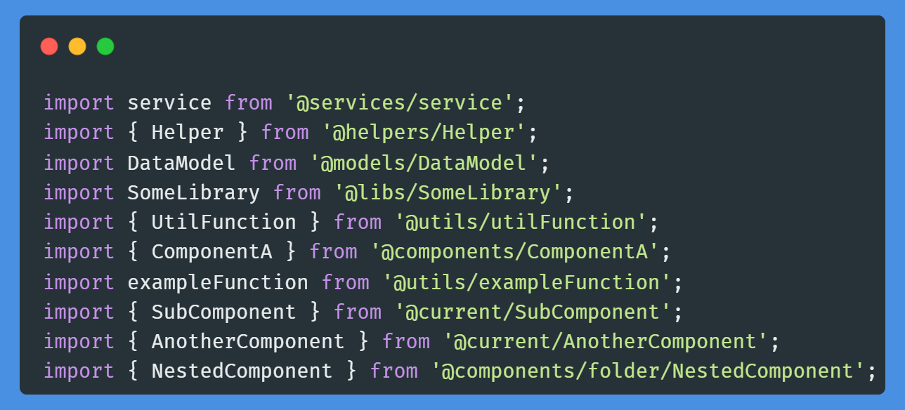

<h1 align="center">TS Import Refiner</h1>

<div align="center">
    <p><a href="https://github.com/AliRezaBeigy/tsimportrefiner/blob/master/LICENSE"></a>
    <a href="http://makeapullrequest.com"></a>
    
    </p>
</div>

TSImportRefiner is a powerful jscodeshift script designed to optimize and sort TypeScript imports based on path aliases defined in `tsconfig.json`. It automates the refactoring of import statements, making your codebase cleaner and more maintainable.
<div align="center">
<table>
  <tr>
    <td align="center"><b>Before</b></td>
    <td align="center"><b>After</b></td>
  </tr>
  <tr>
    <td></td>
    <td></td>
  </tr>
</table>
</div>

## Features

- **Alias Conversion**: Converts module paths to aliases as defined in your `tsconfig.json`.
- **Sort Imports**: Sorts import statements based on line length.
- **Seamless Integration**: Works with existing TypeScript projects with minimal setup.

## Prerequisites

Before you begin, ensure you have installed Node.js and `jscodeshift`:

```bash
npm install -g jscodeshift
```

## Installation

Install TSImportRefiner globally via npm:

```bash
npm install -g tsimportrefiner
```

## Usage

To refactor a file or a directory of files, run:

```bash
tsimportrefiner <path> [options]
```

Where `<path>` can be a single file or a directory. `[options]` are optional arguments that you would normally pass to `jscodeshift`.

## Example

```bash
tsimportrefiner ./src --extensions=ts,tsx
```

This command will process all `.ts` and `.tsx` files in the `src` directory.

## Contributing

Contributions are what make the open-source community such an amazing place to learn, inspire, and create. Any contributions you make are **greatly appreciated**.

1. Fork the Project
2. Create your Feature Branch (`git checkout -b feature/AmazingFeature`)
3. Commit your Changes (`git commit -m 'Add some AmazingFeature'`)
4. Push to the Branch (`git push origin feature/AmazingFeature`)
5. Open a Pull Request

## License

Distributed under the MIT License. See `LICENSE` for more information.

## Acknowledgements

- [jscodeshift](https://github.com/facebook/jscodeshift)
- [TypeScript](https://www.typescriptlang.org/)

---

Feel free to adjust the contents to fit the specifics of your project better, such as adding more detailed usage instructions, screenshots, or additional sections as necessary.